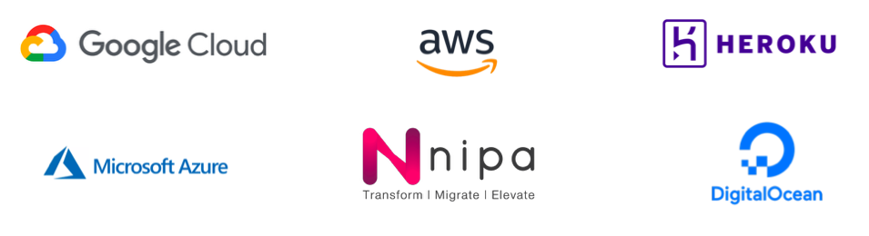

# Cloud

ในเวลาต่อ ๆ มา มีบริษัทหลาย ๆ เจ้า เช่น Google, Amazon, Microsoft เป็นต้น
ที่มาทำ**บริการ VM ให้เราใช้งานกันได้โดยไม่ต้องจัดการ Servers ด้วยตัวเอง** ซึ่งเราสามารถใช้งานได้จากการเลือกใช้ Package ที่เค้าขายเราเช่นเราจะเอาเครื่อง Ram เท่าไหร่ Memory เท่าไหร่

 
 

[Table of content](https://github.com/napatwongchr/intro-to-container)
