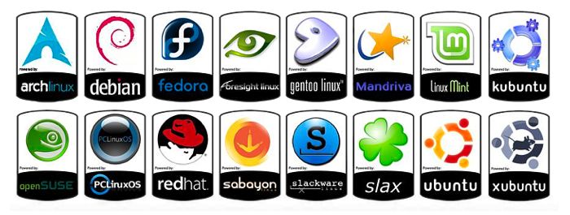
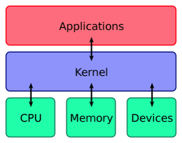
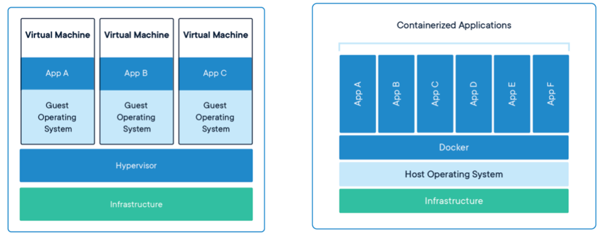

# Containers

มันน่าจะดีกว่าถ้าเราไม่ต้อง Run OS บน VM ทั้งตัวเพื่อที่จะ Run App ของเราบน Server ซึ่งนำมาสู่ Technology ที่เรียกว่า **“Container”**

ให้เรามอง Cotainer เหมือนเป็นการที่เรา Pack ของที่เราจำเป็นต้องใช้เข้ากล่อง เพื่อที่จะนำไปใช้ในที่อื่น ๆ ได้ทันที

ก่อนที่เราจะไปดู Technology ของ Container ต่อ เราจะมาทำความเข้าใจเกี่ยวกับ Linux กับ Kernel เบื้องต้นกันก่อน

 
 

## Linux

Linux คือ Unix-Like **Operating System** ตัวนึง ซึ่งมีหลายยี่ห้อ

 
 

## Kernel

Kernel คือ เป็นตัวหลักสำคัญ ของ Operating System ในการ**จัดการ Operation ของ Hardwares และ Applications** บน Computer

 
 

## Continue on Container

Container เป็น Combination ของ **Linux Kernel Features 3 ตัว**

1.  **chroot** — เป็นตัวสร้าง root directory ให้กับ process ใหม่

2.  **namespaces** — เป็นตัวกันไม่ให้ process ที่อยู่ใน chroot env เห็น process อื่น ๆ

3.  **cgroups** — เป็นการ limit physical resources ให้กับ process

 
 

## VM vs Container

- Container ไม่ต้อง Start เครื่องใหม่ทั้งเครื่องในการที่จะ Run Application เหมือน VM ทำให้ Container **"Lightweight"** มากกว่า VM มาก

- ปกติแล้ว VM จะ Virtualize Hardware ของเครื่อง เพื่อที่จะสร้าง VM ขึ้นมา ส่วน Container จะ Virtualize จาก OS ที่อยู่บนเครื่องนั้น ๆ ทำให้ไม่ต้องมีหลาย OS ในเครื่องเดียว

 
 

[Table of content](https://github.com/napatwongchr/intro-to-container)
