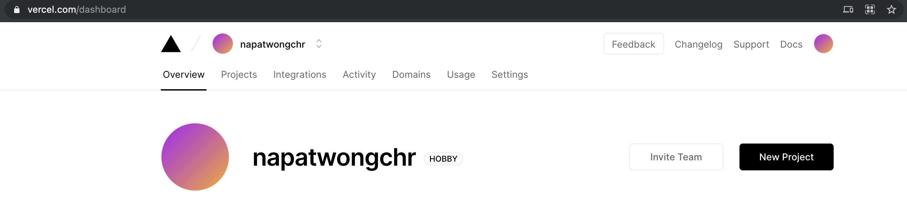
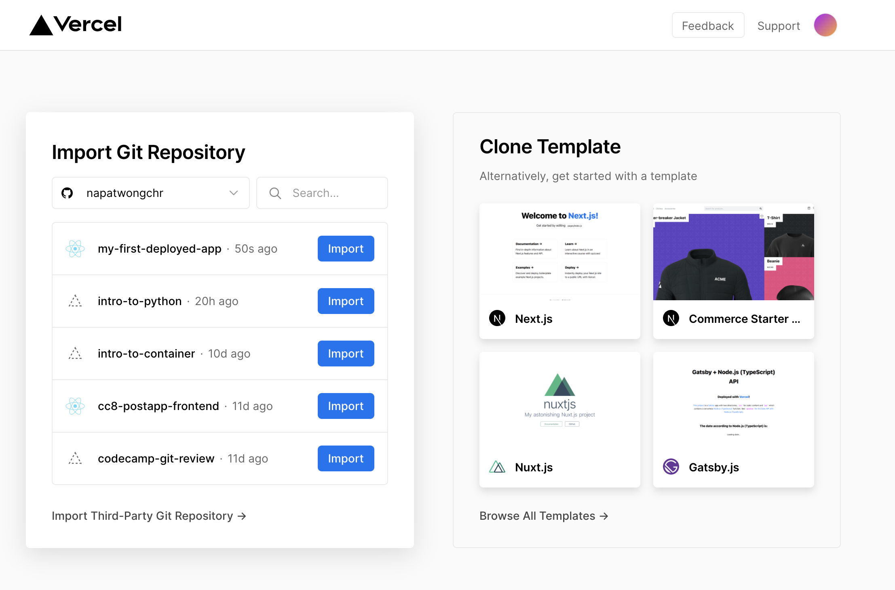
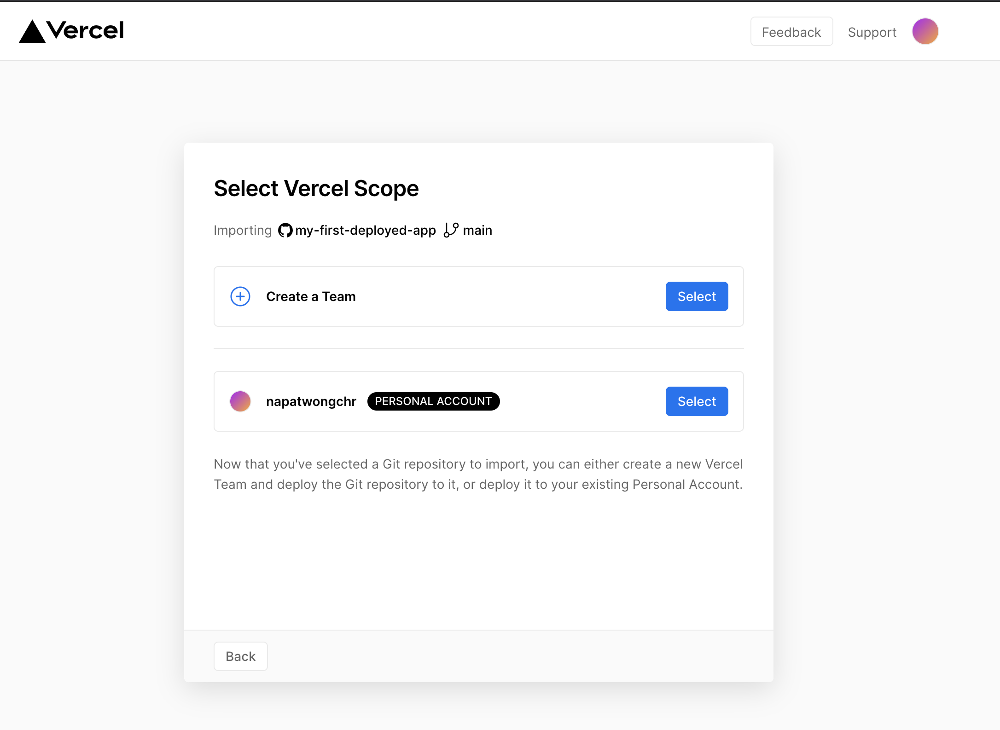
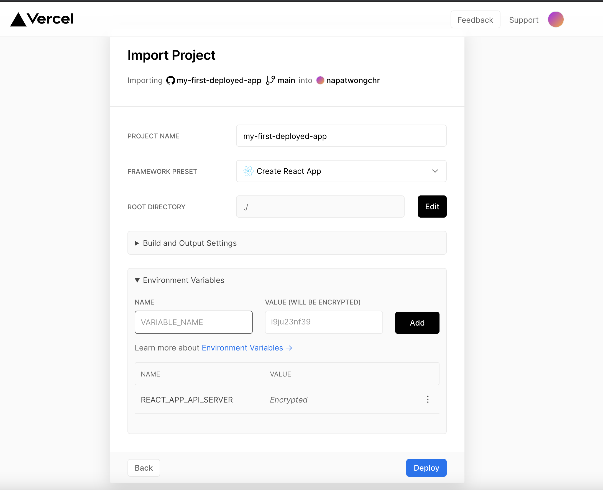
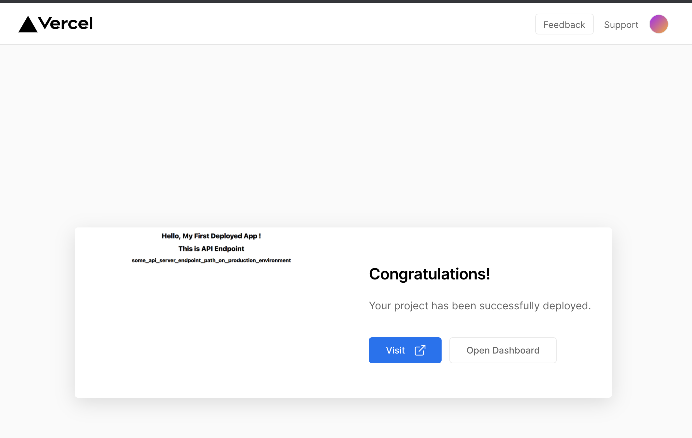

# Deploy React App to Vercel

## What is Vercel

Vercel เป็น deployment platform **สำหรับ frontend developer**

<br><hr><br>

## Let's Deploy React Application

1. เข้าไปสมัคร [Vercel](https://vercel.com/signup) ก่อน

2. จากนั้นสร้าง Project React ขึ้นมาด้วยคำสั่ง

`npx create-react-app my-first-deploy-react`

3. สร้างไฟล์ `.env` จากนั้นใส่ variable ที่เก็บ API Endpoint

**ทำไมต้องมี .env ?**

เวลาเราพัฒนา application เราจะพัฒนาอยู่บนเครื่องของเราเอง สังเกตว่าเวลา call API เราจะต้อง start backend server ขึ้นมา ซึ่งรันที่ `localhost:8000`

แต่เวลาเราจะให้ user ใช้งาน app ของเราจริง ๆ เราจะต้อง deploy app ของเราขึ้นไปวางไว้ที่ host ที่เราจะใช้บริการ เราจะต้อง call API ไปที่ endpoint path ที่เรา deploy app ของเราขึ้นไป เราเลยจำเป็นจะต้องเก็บ API endpoint ไว้เป็นตัวแปรในไฟล์ `.env` เราเรียกว่า **"Environment Variables"**

**Environment Variables สำหรับ Create React App จะมี REACT_APP** นำหน้าชื่อ variable อีกที\*\*

หน้าตาของไฟล์ .env เราจะเป็นแบบนี้

```
REACT_APP_API_ENDPOINT=our_api_endpoint
```

4. ให้เราใส่ `.env` ไว้ใน `.gitignore` ด้วยเราจะไม่ commit `.env` ขึ้นไปบน Github repo

5. จากนั้นให้แก้ code ที่ `src/App.js` เพื่อลองเอา Environment Variables มาแสดงผล

เราสามารถ access environment variable ผ่าน `process.env` ได้เลย

```js
import "./App.css";

function App() {
  return (
    <div className="App">
      <h1>Hello, My First Deployed App !</h1>
      <h1>This is API Endpoint</h1>
      <h2>{process.env.REACT_APP_API_SERVER}</h2>
    </div>
  );
}

export default App;
```

6. จากนั้นให้เราสร้าง Github repository ขึ้นมา แล้ว upload code ขึ้นไปใน Github repo ให้เรียบร้อย

7. กลับไปที่ Vercel แล้วกดไปที่ **New Project**



8. ทำการ Import git repo ที่เรา upload react app ขึ้นไป



9. ขั้นตอนต่อไปเราสามารถ เลือก Scope ที่เราจะ deploy ได้ ว่าเราจะเลือก deploy แบบ team หรือ personal



10. จากนั้นเราสามารถที่จะ Settings การ Deploy ของเราได้

- จุดที่สำคัญคือ Environment Veriables ให้เราใส่ Env Vars ตามที่เราต้องการได้เลย ในที่นี้เรามีแค่ 1 ตัวคือ `REACT_APP_API_SERVER` ซึ่งเราจะใส่ให้เป็น API Server Endpoint ที่เรา deploy backend app ขึ้นไป



11. จากนั้นเรากด `Deploy` ได้เลย แล้วรอสักแปปนึง app ของเราก็จะถูก deploy ขึ้นไปบน server ของ vercel เรียบร้อย ให้เรากด `Visit` เพื่อดู app ของเรา



<br><hr><br>

[Table of content](https://github.com/napatwongchr/intro-to-container)
