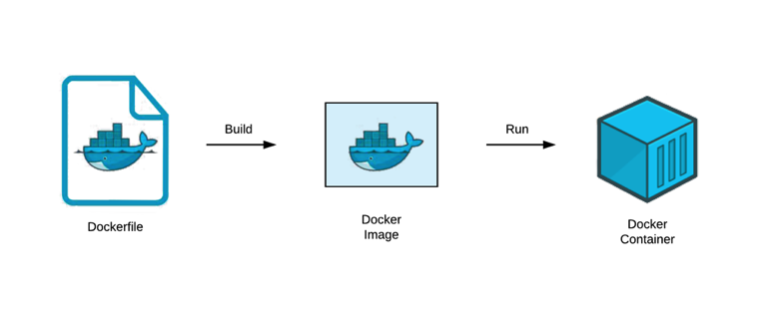

# Docker File

Docker File เป็นตัวที่เอาไว้สร้าง Image เพื่อนำไปสร้าง Container อีกทีนึง



<br><hr><br>

## Building NodeJS Images

1. Setup Node App ขึ้นมาก่อน

- สร้าง Folder Project หลัก `my-project`

- สร้าง Folder `backend` ข้างใน `my-project` แล้วทำการ cd เข้าไปใน `backend` แล้วเขียนคำสั่ง `npm init -y`

- ลง Dependencies ของ Node Server

`npm install --save express body-parser cors`
`npm install --save-dev nodemon`

2. ทำการสร้าง File `backend/index.js` แล้วเขียน Code server ลงไป

```javascript
const express = require("express");
const app = express();
const port = 3001;

app.get("/", (req, res) => {
  res.send("Hello node app !");
});

app.listen(port, () => {
  console.log(`Example app listening at http://localhost:${port}`);
});
```

3. แก้ script ใน package.json

```javascript
  "scripts": {
    "start": "nodemon index.js"
  },
```

4. สร้าง Dockerfile ที่ backend

```
FROM node:alpine

WORKDIR /app

COPY package.json package-lock.json ./
RUN npm ci
COPY ./ ./

CMD ["npm", "start"]
```

- FROM เป็นคำสั่งที่เอาไว้กำหนด base image ว่าเราจะสร้าง image จากอะไร ในที่นี่เราจะสร้าง image จาก node:alpine
- WORKDIR เป็นคำสั่งที่กำหนด Directory หลักในการทำงาน
- COPY เป็นคำสั่งที่จะ copy files บนเครื่องเราเข้าไปที่ WORKDIR
- RUN เป็นคำสั่งที่ใช้ run คำสั่งใน container
- CMD เป็นคำสั่งที่จะถูกรันเมื่อ container ถูกเปิดขึ้น

5. ทำการสร้าง Image ด้วย Docker Build ด้วยคำสั่ง (รันที่ Root Folder)

```
docker build -t my-first-node-app .
```

6. จากนั้นลอง run container ขึ้นมา

`docker run -dit -p 3001:3001 --rm --name my-first-node-app my-first-node-app`

<br><hr><br>

## Share Image

1. ให้ Build image ด้วยชื่อ docker hub ของตัวเองที่สมัคร `<docker_hub_username>/my-first-node-app`

ถ้าใครยังไม่มีไปสมัครที่ [docker hub](https://hub.docker.com/signup)

จากนั้นให้ login ด้วย `docker login` แล้วใส่ username password ลงไป

ต่อไปให้เรา build image `docker build -t <docker_hub_username>/my-first-node-app .`

2. Push my-first-node-app เข้าไปใน docker hub

```
docker push <docker_hub_username>/my-first-node-app
```

เมื่อเรา Push Image ขึ้นไปบน Docker Hub แล้ว เราสามารถที่จะ Pull ลงมา Run Container บนเครื่องเราได้เลย เราก็จะได้ Node App ที่เราเขียนไว้ขึ้นมา

3. ให้ทุกคนลอง Pull image `napatwongchr/my-first-node-app`

`docker pull napatwongchr/my-first-node-app`

ลงมาแล้วจากนั้น start container

`docker run -dit -p 3001:3001 --rm --name my-first-node-app napatwongchr/my-first-node-app`

<br><hr><br>

[Table of content](https://github.com/napatwongchr/intro-to-container)
