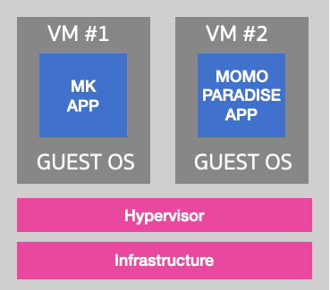
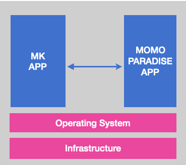

# Virtual Machine Era

ในยุคต่อมามีเทคโนโลยี ที่เรียกว่า **"Virtualization"**

Virtualization เป็นเทคโนโลยีที่ทำให้เครื่องคอม 1 เครื่อง สามารถมีคอมพิวเตอร์เสมือนขึ้นมาได้อีกหลาย ๆ เครื่อง เราเรียกว่า **Virtual Machine**

 
 

## Virtual Machine Overview

ปกติแล้ว เครื่องคอมเรา 1 เครื่องจะมี Operating System 1 ตัว เช่น Windows, Linux, หรือ MacOS

Virtual Machine ทำให้เรา Run OS มากกว่า 1 ตัวบนเครื่องได้

และทำให้เราสามารถแยกการทำงานของแต่ละ App ออกจากกันได้อย่างสมบูรณ์ ยกตัวอย่างเช่น App A ของบริษัทนึง ก็ Run อยู่บนเครื่อง VM และ App B ของบริษัทนึง ก็ Run VM อีกเครื่อง

🌟 **ข้อดีของ Virtual Machine** 🌟

ทำให้ลดปัญหาการเข้าถึงกันของ APP สองตัวที่อยู่บนเครื่อง Physical Server เดียวกันได้โดยตรง เนื่องจาก VM ไม่มี Feature ที่สามารถไป Access อะไรของ VM ที่อยู่บนเครื่องเดียวกันได้ ถ้าพังก็พังในตัวเองไม่ไปพาคนอื่นพังด้วย

 
 

[Table of content](https://github.com/napatwongchr/intro-to-container)
