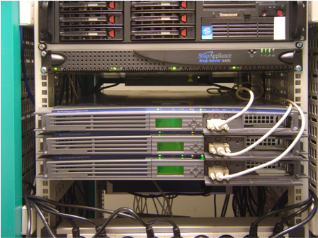

# History of Physical Server

เมื่อสมัยก่อนเวลาเราจะเอา Web Application ของเราสักตัวนึงให้คนใช้ผ่าน Internet เราจะต้องซื้อ Hosting Server แล้ว Hosting Server เนี่ยก็จะวางตัวอยู่ที่ Data Center ต่าง ๆ ที่นิยมในไทยเราก็คือ CAT Data Center เป็นต้น

 
 

## Cons of Physical Server

Physical Servers จะมีข้อจำกัดหลายๆ อย่าง

1. เวลาเราจะทำการขยาย Server เนื่องจากผู้ใช้งานเพิ่มขึ้น เราก็ต้องโทรไปขอเครื่อง Server แล้วก็ทำการ Set Up Program ต่าง ๆ ที่ Web App เราต้องการใช้

2. จากนั้นเรายังต้องทำการดูแลเรื่องของ Version ของ Software, Drivers ต่าง ๆ บนในเครื่อง Server

3. ยังมีปัญหาเรื่องของระบบ Network สายหลุดบ้าง เสียบ้าง, อุณหภูมิ ของห้องที่เหมาะสมในการวางเครื่อง, เรื่องคนดูแลในห้อง Data center และอีกหลาย ๆ อย่าง

[อ่านเพิ่มเรื่องประสบการณ์การวางเครื่อง Server ที่ CAT](https://www.freeware.in.th/blog/21387)

 
 

## Pros of Physical Server

Physical Servers ก็มีข้อดี และหลายๆที่ก็ยังใช้อยู่

1. ถ้าสามารถ Manage เองได้ จะค่อนข้างประหยัด

2. เราสามารถควบคุมเองได้ทุกอย่าง ตามที่เราต้องการ (แต่ต้องมีความรู้ และประสบการณ์ในเรื่องของการจัดการ Server เป็นอย่างดี)

 
 
