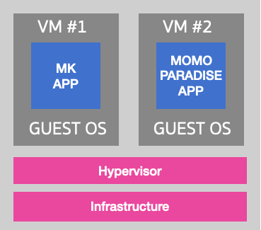
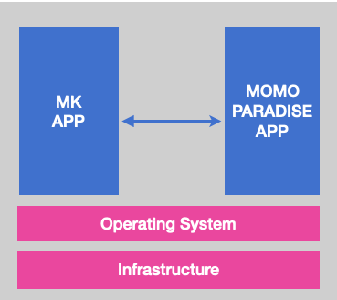

# Virtual Machine Era

เนื่องจาก Physical Servers จัดการอะไรหลาย ๆ อย่างลำบาก จึงเกิดสิ่งที่เรียกว่า **“Virtual Machine” (VM)**

Virtual Machine **เป็น Layer ตรงกลางระหว่าง “เรา” และ “Physical Servers”**

ปกติแล้ว เครื่องคอมเรา 1 เครื่องจะมี Operating System 1 ตัว เช่น Windows, Linux, หรือ MacOS

Virtual Machine ทำให้เรา Run OS มากกว่า 1 ตัวบนเครื่องได้ ทำให้เราสามารถแยกการทำงานของแต่ละ App ออกจากกันได้อย่างสมบูรณ์ App A ของบริษัทนึง ก็ Run VM ตัวนึง App B ของบริษัทนึง ก็ Run VM อีกตัวนึง

ทำให้ลดปัญหาการเข้าถึงกันของ APP สองตัวที่อยู่บนเครื่อง Physical Server เดียวกันได้โดยตรง เนื่องจาก VM ไม่มี Feature ที่สามารถไป Access อะไรของ VM ที่อยู่บนเครื่องเดียวกันได้ ถ้าพังก็พังในตัวเองไม่ไปพาคนอื่นพังด้วย
